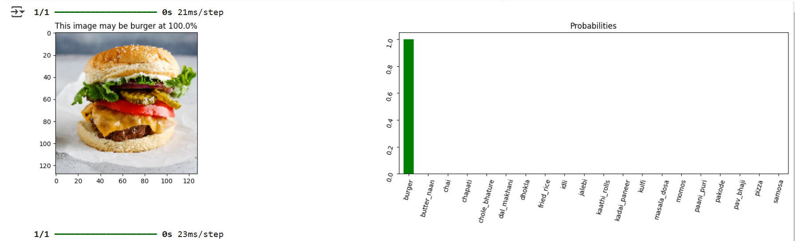

# FoodImageClassification-MultiClass

Multi-class food image classification using CNNs for 20 food types. Trained on 6269 images (4389 train, 1880 val).

## Overview

This repository contains a Jupyter Notebook for building and training a Convolutional Neural Network (CNN) to classify images of 20 different food items. The model is designed to identify dishes commonly found in [Mention the region/cuisine if applicable, e.g., "Indian cuisine"].

**Food Classes:**

*   burger
*   butter\_naan
*   chai
*   chapati
*   chole\_bhature
*   dal\_makhani
*   dhokla
*   fried\_rice
*   idli
*   jalebi
*   kaathi\_rolls
*   kadai\_paneer
*   kulfi
*   masala\_dosa
*   momos
*   paani\_puri
*   pakode
*   pav\_bhaji
*   pizza
*   samosa

## Getting Started

### Prerequisites

*   Python 3.6 or higher
*   Jupyter Notebook
*   The following Python libraries (install using `pip`):

    *   tensorflow
    *   keras
    *   matplotlib
    *   numpy
    *   scikit-learn
    *   [Add any other specific libraries]

### Installation

1.  Clone the repository:

    ```
    git clone https://github.com/ParmarGhanshyam/FoodImageClassification-MultiClass.git
    ```

2.  Navigate to the project directory:

    ```
    cd FoodImageClassification-MultiClass
    ```

3.  Install the required libraries:

    ```
    pip install -r requirements.txt
    ```

    (Create `requirements.txt` using `pip freeze > requirements.txt`)  It's recommended to use a virtual environment.

### Usage

1.  Open the Jupyter Notebook:

    ```
    jupyter notebook multi_class_food_image_classes_classifications.ipynb
    ```

2.  Run the cells in the notebook sequentially to train and evaluate the model.

## Dataset

The dataset used in this project is the [Indian Food Classification dataset](https://www.kaggle.com/datasets/l33tc0d3r/indian-food-classification) available on Kaggle, created by l33tc0d3r. It consists of 6269 food images, split into a training set of 4389 images and a validation set of 1880 images. The images are of various Indian food dishes, categorized into the 20 classes listed above.

## Model Architecture

The CNN architecture is built using the Keras Functional API and incorporates residual connections. It consists of an image augmentation block followed by convolutional and normalization layers. Here's a breakdown:

1.  **Image Augmentation:** The input image is passed through a data augmentation block (`data_augmentation`) implemented as a `Sequential` model. This block includes:
    *   `RandomFlip("horizontal")`: Randomly flips images horizontally for data augmentation.
    *   `RandomRotation(0.1)`: Randomly rotates images by up to 10 degrees.

2.  **Normalization:** Pixel values are normalized to the range \[0, 1] by rescaling by 1/255.

3.  **Entry Block:**
    *   A `Conv2D` layer with 64 filters, a kernel size of 3, and a stride of 2, using "same" padding.
    *   `BatchNormalization` to normalize the activations.
    *   `ReLU` activation function.
    *   Another `Conv2D` layer with 64 filters and a kernel size of 3, using "same" padding.
    *   `BatchNormalization`.
    *   `ReLU` activation function.

4.  **Residual Blocks:** The output of the entry block is passed through a series of four residual blocks. Each block consists of:
    *   `ReLU` activation.
    *   `SeparableConv2D` layer with filter sizes of 128, 256, 512, and 512 in successive blocks, a kernel size of 3, and "same" padding.
    *   `BatchNormalization`.
    *   `ReLU` activation.
    *   Another `SeparableConv2D` layer with the same filter size and kernel size as above.
    *   `BatchNormalization`.
    *   `MaxPooling2D` layer with a pool size of 3, a stride of 2, and "same" padding.
    *   **Residual Connection:** A `Conv2D` layer with a kernel size of 1 and a stride of 2, using "same" padding, is applied to the *input* of the block (`previous_block_activation`) to project it to the same dimensions as the output of the convolutional layers. The output of this `Conv2D` layer is then *added* back to the output of the convolutional layers (`layers.add([x, residual])`). This creates a residual connection.

5.  **Final Convolutional Block:** A `SeparableConv2D` layer with 1024 filters, a kernel size of 3, and "same" padding is applied, followed by `BatchNormalization` and `ReLU` activation.

6.  **Classification Block:**
    *   `GlobalAveragePooling2D` to reduce the spatial dimensions.
    *   `Dropout` layer with a rate of 0.5 for regularization.
    *   A `Dense` (fully connected) layer with `num_classes` units and a `softmax` activation function for multi-class classification.

The model architecture is defined in the `make_model` function within the Jupyter Notebook.


## Results




## Future Work

*   Improve accuracy by experimenting with different CNN architectures and hyperparameters.
*   Expand the dataset to include more food classes.
*   Deploy the model as a web application.

## License

This project is licensed under the MIT License - see the [LICENSE](LICENSE) file for details.  (Create a LICENSE file in your repository with the MIT license text.)
